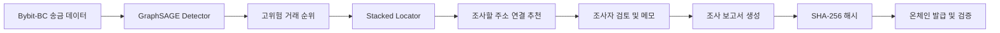
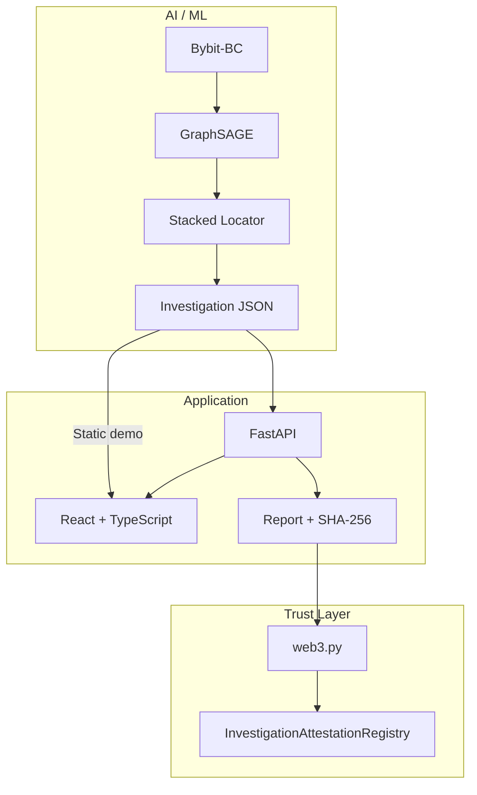

# TraceLens

### 설명 가능한 GNN과 온체인 위험 증명을 활용한 불법자금 흐름 조사 지원 서비스

TraceLens는 수많은 블록체인 송금 중 **먼저 조사할 고위험 거래**를 찾고, 해당 거래 안에서 **우선 확인할 주소 연결**을 추천합니다. 조사자는 추천 결과와 거래 그래프를 검토해 보고서를 만들고, 기관 간에 전달되는 보고서의 해시를 블록체인에 기록해 발급자·무결성·유효 상태를 검증할 수 있습니다.

> BLOCK AI✳26 Track 1 출품을 위해 개발한 MVP입니다.

## 문제 정의

기존 위험 탐지 모델이 거래 전체에 위험 점수만 부여하면 조사자는 다시 복잡한 자금 흐름을 처음부터 확인해야 합니다. TraceLens는 탐지 결과를 실제 조사 작업으로 연결하기 위해 두 가지 질문을 분리해서 처리합니다.

1. **Detector:** 어떤 거래를 먼저 조사해야 하는가?
2. **Locator:** 그 거래 안에서 어떤 송금 연결을 먼저 확인해야 하는가?

조사가 끝난 뒤에는 보고서 원문 대신 SHA-256 해시만 블록체인에 기록합니다. 이를 통해 민감한 조사 내용은 외부에 공개하지 않으면서 기관 간에 같은 보고서인지 검증할 수 있습니다.

## 핵심 기능

| 기능 | 설명 |
|---|---|
| 위험 거래 선별 | GraphSAGE가 주소의 행동 특징과 주변 연결 구조를 학습해 송금 위험도를 계산합니다. |
| 거래 내부 위치 추천 | Stacked Pairwise Locator가 한 거래에 포함된 송금 연결을 조사 우선순위로 정렬합니다. |
| 거래 그래프 시각화 | Cytoscape.js로 주소와 자금 이동 관계를 표시하고 추천 연결을 강조합니다. |
| 조사자 검토 | 추천 연결별 상태와 조사 메모를 기록해 보고서에 포함합니다. |
| 보고서 무결성 | 결정적 JSON 직렬화 후 SHA-256 해시를 생성해 내용 변경을 탐지합니다. |
| 온체인 증명 | 승인된 기관이 보고서 해시를 발급하고, 발급자·발급 시점·취소 상태를 검증합니다. |
| 정적 데모 | 백엔드 없이도 Vercel에서 사건 조회, 그래프 확인, 보고서 생성과 로컬 무결성 검증이 동작합니다. |

## 사용 흐름



조사 화면에서는 다음 순서로 작업합니다.

1. 대시보드에서 위험 점수가 높은 사건을 선택합니다.
2. 거래 그래프와 추천 연결 순위를 확인합니다.
3. 연결을 선택해 `추가 조사 필요`, `특이사항 없음`, `보류` 상태와 메모를 기록합니다.
4. 조사 보고서를 생성하고 JSON으로 내보냅니다.
5. 전체 모드에서는 보고서 해시를 온체인에 발급하거나 외부 보고서의 무결성과 상태를 검증합니다.

## AI 구조

### 1. GraphSAGE Detector

주소를 노드, 송금을 방향성 간선으로 구성한 그래프에서 위험 송금을 분류합니다. 거래 금액과 거래 내부 특징뿐 아니라 주소의 과거 송수신 행동과 주변 주소의 연결 정보를 함께 사용합니다.

거래 단위 위험도는 해당 거래에 포함된 송금의 GraphSAGE 점수 중 최댓값으로 계산합니다.

### 2. Stacked Pairwise Locator

Detector와 Locator는 목적이 다르므로 별도 모델로 구성했습니다. Locator는 동일한 `txhash`에 속한 송금들을 비교해 실제 조사할 연결을 순위화합니다.

```text
거래 내부 금액·순위·주소 역할 특징
                  +
          GraphSAGE 위험 점수
                  ↓
       Stacked Pairwise Locator
                  ↓
          조사 연결 우선순위
```

GNN 학습에 사용되지 않은 Validation 점수로 Locator를 학습하고 Test 구간에서 평가해 학습 데이터 점수의 재사용을 피했습니다.

## 평가 결과

Bybit-BC 데이터는 날짜 순서에 따라 분할했습니다.

| 분할 | 기간 시작 조건 | 송금 수 |
|---|---|---:|
| Train | 2025-03-01 이전 | 72,809 |
| Validation | 2025-03-01 이상, 2025-03-04 이전 | 38,267 |
| Test | 2025-03-04 이상 | 23,201 |

### GraphSAGE Detector — Test

| 지표 | 결과 |
|---|---:|
| Precision | 0.8342 |
| Recall | 0.7607 |
| F1 | 0.7958 |
| PR-AUC | **0.8300** |

### 조사 예산별 성능 — Test

| 조사 범위 | 발견 수 | Precision | Recall | Lift |
|---|---:|---:|---:|---:|
| Top-100 | 94 | 0.9400 | 0.0673 | 15.62배 |
| Top-500 | 415 | 0.8300 | 0.2973 | 13.79배 |
| Top-1000 | 891 | 0.8910 | 0.6383 | 14.81배 |
| 상위 5% | 1,012 | 0.8717 | 0.7249 | 14.49배 |
| 상위 10% | 1,340 | 0.5773 | **0.9599** | 9.60배 |

Test 구간에서 전체 송금의 상위 10%를 조사 대상으로 선택했을 때 실제 위험 송금의 95.99%가 포함됐습니다.

### Stacked Locator — Test 혼합 거래 145건

| 방법 | Hit@1 | Hit@3 | Hit@5 | MRR |
|---|---:|---:|---:|---:|
| External-then-amount 규칙 | 0.9034 | 0.9655 | 0.9724 | 0.9366 |
| Pairwise Locator | 0.8828 | 0.9586 | 0.9655 | 0.9225 |
| **GNN Stacked Locator** | **0.9172** | **0.9862** | **0.9931** | **0.9497** |

Stacked Locator는 혼합 거래 145건 중 133건에서 실제 의심 송금을 1위에 배치했습니다. 규칙 기반 방법과의 차이는 2건이므로, GNN 문맥이 위치 추천에 추가 신호를 제공한 결과로 해석합니다.

## 시스템 구성



### 두 가지 실행 모드

| 모드 | 데이터 소스 | 사용 가능한 기능 |
|---|---|---|
| 정적 데모 | `frontend/public/demo` | 사건 조회, 그래프, 검토, 보고서 생성, 브라우저 무결성 검증 |
| 전체 모드 | FastAPI + Hardhat/EVM | 정적 데모 기능 + 온체인 발급·조회·취소·외부 보고서 검증 |

`VITE_API_BASE_URL`이 없으면 정적 데모 모드로 실행됩니다. 백엔드 URL을 설정하면 기존 화면이 자동으로 FastAPI를 사용합니다.

## 빠른 실행: 백엔드 없는 정적 데모

### 요구 사항

- Node.js LTS
- npm

### 실행

```powershell
cd frontend
npm install
npm run dev
```

브라우저에서 [http://localhost:5173](http://localhost:5173)을 엽니다.

### Vercel 배포

백엔드 없이 배포할 때는 `VITE_API_BASE_URL`을 설정하지 않습니다.

```powershell
cd frontend
npm run build
npx vercel login
npx vercel --prod
```

Vercel Dashboard에서 Git 저장소를 연결할 경우 다음 값을 사용합니다.

| 항목 | 값 |
|---|---|
| Root Directory | `frontend` |
| Framework Preset | Vite |
| Build Command | `npm run build` |
| Output Directory | `dist` |

`frontend/vercel.json`이 `/investigation`, `/report`, `/verify` 직접 접근을 React 애플리케이션으로 연결합니다.

## 전체 시스템 로컬 실행

### 1. 블록체인

첫 번째 터미널:

```powershell
cd blockchain
npm install
npm run node
```

두 번째 터미널:

```powershell
cd blockchain
npm run deploy:local
```

배포 출력의 컨트랙트 주소와 로컬 발급자 계정 정보를 `backend/.env`에 설정합니다.

```env
BLOCKCHAIN_RPC_URL=http://127.0.0.1:8545
CONTRACT_ADDRESS=<deployed-contract-address>
ISSUER_PRIVATE_KEY=<local-demo-account-private-key>
```

### 2. 백엔드

```powershell
cd backend
python -m venv .venv
.\.venv\Scripts\Activate.ps1
pip install -r requirements.txt
python -m uvicorn app.main:app --reload
```

확인 주소:

- API 상태: [http://localhost:8000/health](http://localhost:8000/health)
- Swagger 문서: [http://localhost:8000/docs](http://localhost:8000/docs)

### 3. 프론트엔드

`frontend/.env.local`을 만듭니다.

```env
VITE_API_BASE_URL=http://localhost:8000
```

실행합니다.

```powershell
cd frontend
npm install
npm run dev
```

## AI 결과 생성

프로젝트 루트에서 Python 환경을 준비합니다.

```powershell
python -m venv .venv
.\.venv\Scripts\Activate.ps1
pip install -r requirements.txt
```

기존 학습 모델과 점수 파일로 데모 사건을 다시 생성하려면 다음을 실행합니다.

```powershell
python ml/inference/build_demo_cases.py
python ml/inference/export_backend_cases.py
```

출력 파일:

| 경로 | 용도 |
|---|---|
| `demo/data/investigation_cases.json` | ML 특징, 점수, 근거를 포함한 전체 사건 묶음 |
| `demo/backend_cases/analysis-*.json` | FastAPI가 읽는 사건별 JSON |
| `frontend/public/demo/cases.json` | 정적 데모의 사건 목록 |
| `frontend/public/demo/cases/analysis-*.json` | 정적 데모의 사건 상세 |

원본 데이터와 학습 산출물인 `ml/data`, `ml/outputs`는 Git에 포함하지 않습니다.

## 주요 API

| Method | Endpoint | 설명 |
|---|---|---|
| `GET` | `/health` | 서비스 상태와 분석 데이터 경로 확인 |
| `GET` | `/api/cases` | 조사 사건 목록 |
| `GET` | `/api/cases/{analysis_id}` | 사건 상세, 그래프, 추천 연결 |
| `POST` | `/api/reports` | 조사자 검토를 포함한 보고서와 SHA-256 해시 생성 |
| `POST` | `/api/reports/issue` | 보고서 해시 온체인 발급 |
| `GET` | `/api/reports/attestation/{report_hash}` | 온체인 발급 정보 조회 |
| `POST` | `/api/reports/verify` | 파일 해시와 온체인 상태 검증 |
| `POST` | `/api/reports/revoke` | 발급자가 보고서 상태를 취소로 변경 |

## 스마트 컨트랙트

`InvestigationAttestationRegistry`는 다음 정보만 온체인에 저장합니다.

```solidity
struct Attestation {
    address issuer;
    uint256 issuedAt;
    bool revoked;
}
```

- `issueReport(bytes32 reportHash)`: 승인된 발급자가 보고서 해시 등록
- `getAttestation(bytes32 reportHash)`: 발급자, 발급 시점, 취소 상태 조회
- `revokeReport(bytes32 reportHash)`: 원래 발급자가 보고서 취소
- `isActive(bytes32 reportHash)`: 현재 유효 상태 확인

보고서 원문, 거래 그래프, 조사자 메모, 데이터셋과 개인정보는 온체인에 저장하지 않습니다.

## 프로젝트 구조

```text
TraceLens/
├── ml/                       # 데이터 처리, 특징, GraphSAGE, Locator, 평가
│   ├── datasets/
│   ├── features/
│   ├── graph/
│   ├── models/
│   ├── training/
│   ├── evaluation/
│   └── inference/
├── backend/                  # FastAPI, 보고서 해시, web3.py 연동
├── blockchain/               # Solidity 컨트랙트, Hardhat 배포·테스트
├── frontend/                 # React, Cytoscape.js, 정적 Vercel 데모
├── demo/                     # 서비스용 조사 사건 JSON
├── schemas/                  # ML 조사 사건 JSON Schema
└── docs/                     # 설계 문서
```

## 기술 스택

| 영역 | 기술 |
|---|---|
| AI | Python, PyTorch, PyTorch Geometric, scikit-learn, pandas |
| Frontend | React 19, TypeScript, Vite 8, Cytoscape.js |
| Backend | FastAPI, Pydantic v2, web3.py |
| Blockchain | Solidity 0.8.19, Hardhat, ethers.js |
| Integrity | Deterministic JSON serialization, SHA-256 |

## 검증 명령

```powershell
# Frontend production build
cd frontend
npm run build

# Backend hash determinism
cd backend
.\.venv\Scripts\python.exe tests/test_hashing.py

# Smart contract tests
cd blockchain
npm test
```

## 해석 시 주의사항

- 현재 평가는 사건 기간의 온체인 거래가 확보된 뒤 조사 대상을 선별하는 **사후 조사 성능**입니다. 실시간 미래 거래 탐지 성능을 의미하지 않습니다.
- 주요 GraphSAGE 결과는 시드 42의 단일 실행 결과입니다.
- Locator Test는 혼합 거래 145건을 대상으로 하며, 규칙 기반 방법 대비 Hit@1 차이는 2건입니다.
- Bybit-BC는 날짜별 라벨 비율 변화가 크므로 다른 사건과 체인에 대한 추가 검증이 필요합니다.
- 화면의 `score_drop`은 추천 주소 쌍을 제외한 뒤 남은 위험 점수로 계산한 근사 영향도입니다. 전체 그래프를 다시 추론한 정식 edge ablation 값은 아닙니다.
- 블록체인은 AI 판단의 정확성이나 실제 범죄 여부를 증명하지 않습니다. 보고서의 발급자, 무결성, 발급·취소 상태만 증명합니다.

## 역할 분담

| 역할 | 담당 범위 |
|---|---|
| AI / ML | Bybit-BC 분석, 특징 설계, GraphSAGE Detector, Stacked Locator, 평가, 서비스 JSON |
| Web / Blockchain | 조사 화면, FastAPI, 보고서·해시, 스마트 컨트랙트, 온체인 발급·검증 |

세부 AI 구조와 실행 방법은 [`ml/README.md`](ml/README.md), 스마트 컨트랙트는 [`blockchain/`](blockchain/), 시스템 설계는 [`docs/architecture.md`](docs/architecture.md)에서 확인할 수 있습니다.
